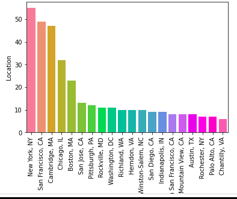
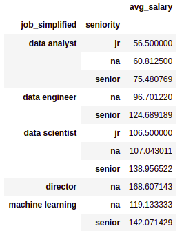
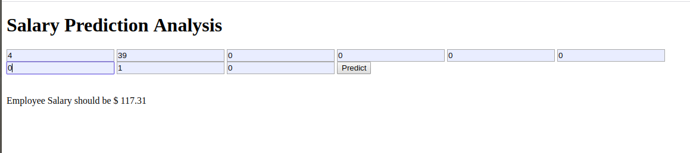

# Job Salaries Estimator for Different Data Science Positions
<ul>
    <li>Designed a tool that estimates job salaries to help data scientists negotiate their income when they are applying for different data science jobs.</li>
    <li>Scraped the job descriptions from glassdoor.com using python and selenium</li>
    <li>Developed Linear, Lasso, and Random Forest Regressors using GridsearchCV to get the best model.</li>
    <li>Deployed the Machine Learning model in Heroku using flask</li>
</ul>

# Links and Resources Used
<ul>
    <li>Web Scraper Article: <a href="https://towardsdatascience.com/selenium-tutorial-scraping-glassdoor-com-in-10-minutes-3d0915c6d905">https://towardsdatascience.com/selenium-tutorial-scraping-glassdoor-com-in-10-minutes-3d0915c6d905</a></li>
    <li>Web Scraper Github: <a href="https://github.com/arapfaik/scraping-glassdoor-selenium">https://github.com/arapfaik/scraping-glassdoor-selenium</a></li>
    <li>Model Deployment Video: <a href="https://www.youtube.com/watch?v=mrExsjcvF4o&feature=youtu.be">https://www.youtube.com/watch?v=mrExsjcvF4o&feature=youtu.be</a></li>
    <li>Model Deployment Github: <a href="https://github.com/krishnaik06/Heroku-Demo">https://github.com/krishnaik06/Heroku-Demo</a></li>
    <li>Packages: pandas, numpy, sklearn, matplotlib, seaborn, selenium, flask, json, pickle</li>
</ul>

# Web Scraping
Used the web scraper github repo (above) to scrape the job postings from glassdoor.com. With each job, we obatin the following:   
<ul>
    <li>Job Title</li>
    <li>Salary Estimate</li>
    <li>Job Description</li>
    <li>Rating</li>
    <li>Company Name</li>
    <li>Location</li>
    <li>Headquarters</li>
    <li>Size</li>
    <li>Founded</li>
    <li>Type of Ownernship</li>
    <li>Industry</li>
    <li>Sector</li>
    <li>Revenue</li>
    <li>Competitors</li>
</ul>

# Data Cleaning
After scraping the data I needed to clean it so that it can be usable for our model. I made the following modifications and created the following variables:
<ul>
    <li>Parsed only the numeric data out of Salary</li>
    <li>Made seperate columns for employer provided salary and hourly wages</li>
    <li>Salary column contained few empty values so removed the rows without Salary</li>
    <li>Parsed rating out of company text</li>
    <li>Made a seperate column for the Company State</li>
    <li>Made a new column to check if the job is at the company’s headquarters</li>
    <li>Added a new column age of company by using the founded date</li>
    <li>Added columns to check if the different skills were listed in the job description:</li>
    <li>Made a new column for simplified job title and Seniority</li>
    <li>Made a new column for description length</li>
    <ul style="list-style-type:circle">
         <li>Python</li>
         <li>R</li>
         <li>Excel</li>
         <li>AWS</li>
         <li>Apache Spark</li>
    </ul>
</ul>

# Exploratory Data Analysis
EDA plays a very important role at this stage as the summarization of clean data helps in identifying the structure, outliers, anomalies, and patterns in data. I looked at the distributions of the data and the value counts for the various categorical variables. Have done the univariate, bivariate analysis, and plotted histograms,boxplots,bar graphs,pivot tables etc. to represent the data.  
     

# Model Building

First, I modified all the categorical variables into dummy variables. Then I splited the data into training and test sets with a test size of 20%. I tried three different models and evaluated them using Mean Absolute Error. I chose MAE because it is kind off easy to interpret and outliers aren’t particularly bad in for this type of model.
<ul>
    <li>Multiple Linear Regression: Base Model</li>
    <li>Lasso Regression: As there are any 0s and 1s(because of the sparse data from the many categorical variables), I have chosen a normalized regression like Lasso and thought it would be effective.</li>
    <li>Random Forest Regression – With the sparsity associated with the data, I thought that this would be a good fit for our data.</li>
</ul>

# Model Performance
The Random Forest model perfored better than the other models on the test set.
<ul>
    <li>Linear Regression MAE: 18.885</li>
    <li>Lasso Regression MAE: 19.665</li>
    <li>Random Forest Regression MAE: 11.142</li>
</ul>

# Model Deployment
I have deployed the model using the flask framework in Heroku which is a Platform As A Service(PAAS) 

Web application: <a href="https://glassdoorsalaryprediction-api.herokuapp.com/">https://glassdoorsalaryprediction-api.herokuapp.com/</a>
